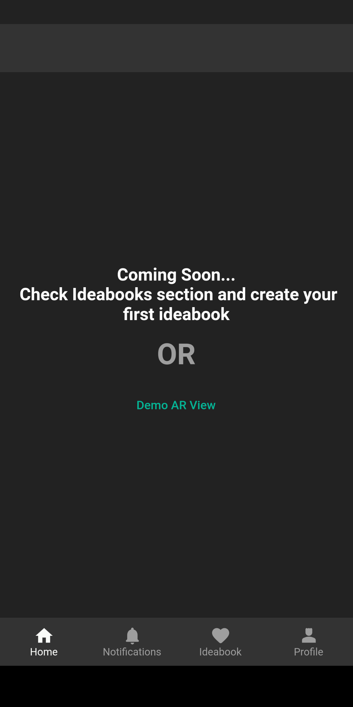
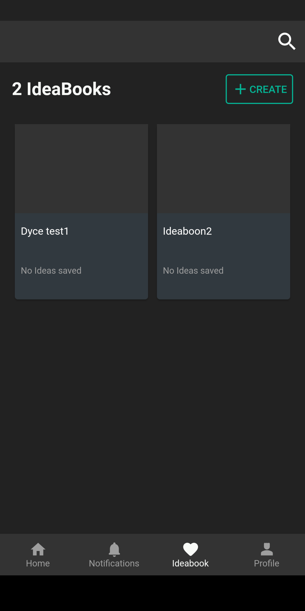
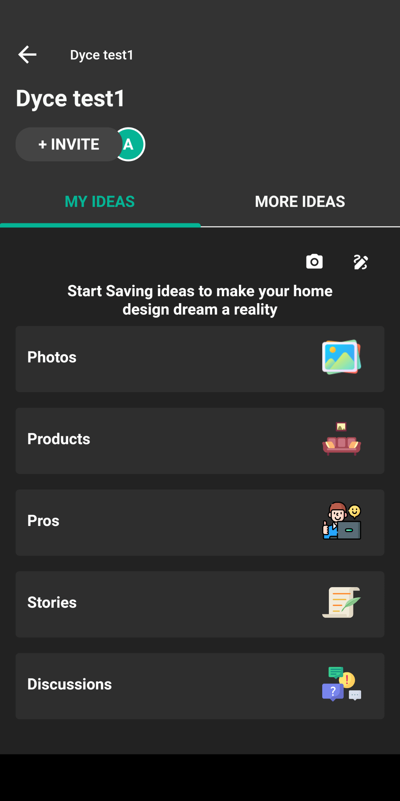
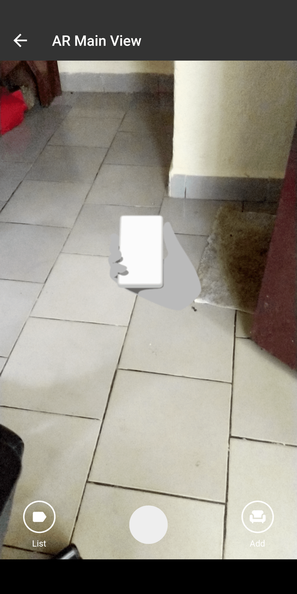
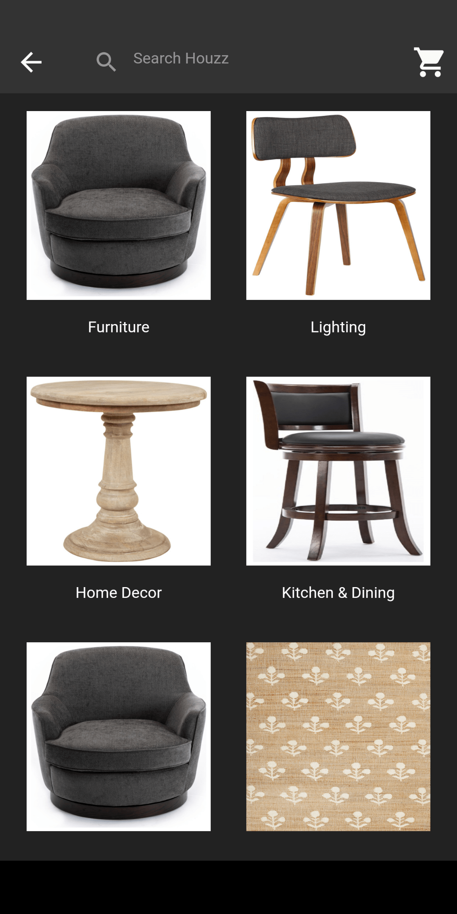
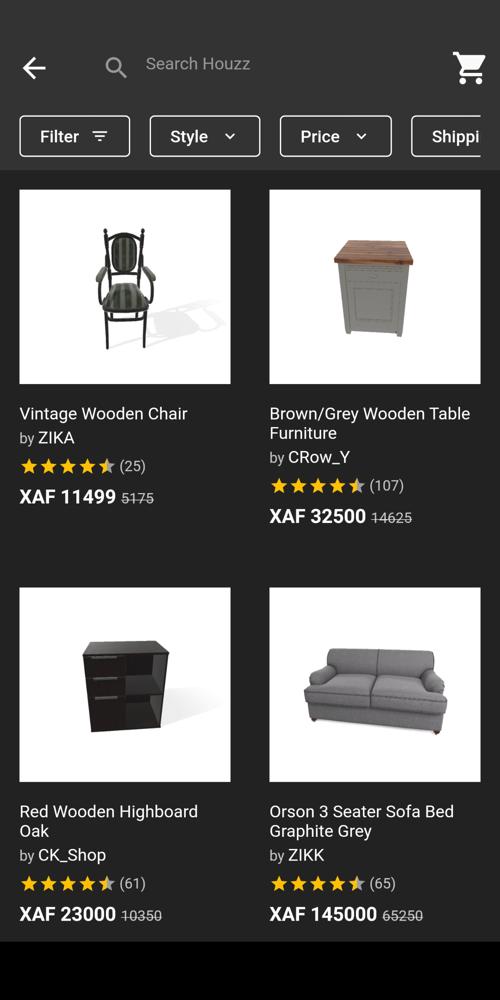
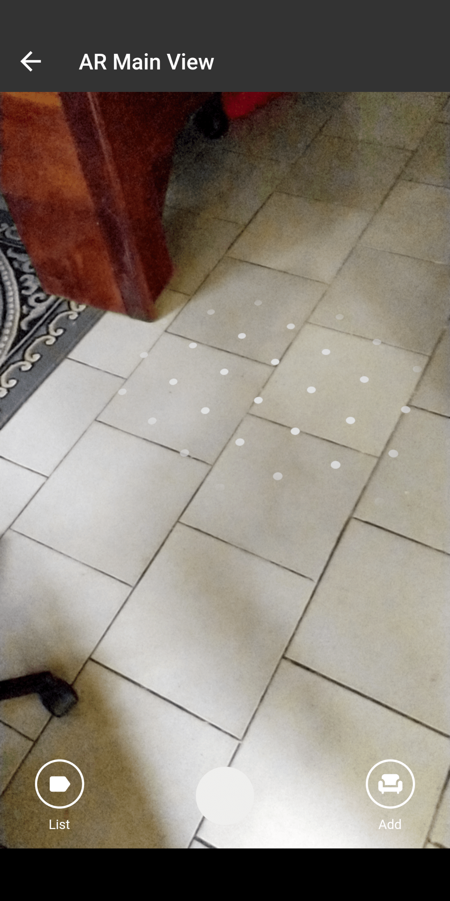
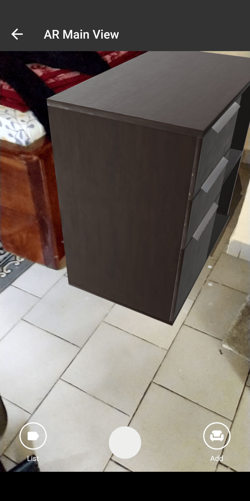

# Decorride

Decorride is an Interior Decor mobile app which allows users to easily leverage the power of AR to create aesthetically pleasing visual designs of their homes.

With decorride, we have the ability to select items from a catalogue of 3d items, and place them virtually on your real environment.

# Motivation
- The motivation of this project is to get more immersive and improve AR skills with flutter.
- Creating this project gave me the ability to really dive into augmented reality experience in flutter, with a view of expanding this knowledge even   further in the future.
- With decorride, users can easily place virtual objects on their real world environment.

# Features
At the moment, this is still a starter project with a majority of features still to be implemented. however, at the moment, a user can
- Create an Ideabook
- Add ideas to the ideabook
- Try out the AR view

# How to try out AR View
Given that that was the main goal of this application, we focused on that first, while creating and adding more as time goes on. To try out the AR  View, you can either
1. -  Click on the > Demo AR View `Demo AR View` from the homescreen
    - Click on the `Add` Button on the bottom right, and then proceed to select an item from the available items.
    - Follow the onscreen directions to scan the environment and then place your product on your environment when  scanning is complete. 

 OR

 2. - Go to ideabooks tab
    - Create an ideabook
    -  On the ideabook, click on the Camera icon to open AR View
    - Add products from the list and place on your virtual environment as stated in step 3 from option 1 above
           
    - Last screenshot shows the object i just placed. Sorry my space is small  😇. Will get a much better demo with future updates

# Getting Started
- Clone the project using `git clone https://github.com/alainjr10/decor-ride.git`
- Get packages using `flutter pub get`
- launch the app using `flutter run`
- Create an account using a test email is you want, and start trying out the app

# Contributing
We welcome contributions from the community to enhance Decorride. There's no official guide for contributing yet. However, If you're interested in contributing, make sure to;
Make sure your code is well-documented and easy to understand.

- Write clean, readable, and maintainable code. Follow the project's coding style and conventions.

- Test your changes thoroughly before submitting a pull request.

- Make sure your changes do not break existing functionality.

- Be respectful and constructive when providing feedback on others' contributions.

- If you have any questions or need further assistance, please contact the maintainers at Email

# Contributors

# You can connect with me 
